# HealthDM — User Guide

SOC health diagnostics for Cortex Platform — run assessments, analyze policies, generate reports, and configure your workspace.

> Open the app in your browser at **http://localhost:8800**

---

## Contents

1. [Getting started](#1-getting-started)
2. [Navigation & layout](#2-navigation--layout)
3. [Cortex Platform assessment](#3-cortex-platform-assessment)
4. [Drilling into a category](#4-drilling-into-a-category)
5. [Dashboard](#5-dashboard)
6. [Policies & Profiles](#6-policies--profiles)
7. [Comprehensive report](#7-comprehensive-report)
8. [Settings — Credentials](#8-settings--cortex-platform-credentials)
9. [Settings — Report Details](#9-settings--report-details)
10. [Settings — Baselines](#10-settings--policies--profiles-baselines)
11. [Settings — Tests](#11-settings--tests)
12. [Theme switcher](#12-theme-switcher)

---

## 1. Getting started

HealthDM runs entirely in your browser. Open **http://localhost:8800** (or the host/port your Docker stack maps to nginx). The app redirects you straight to the **Cortex Platform** page on first load.

> ⚠️ **Before you run your first assessment**, go to [Settings → Cortex Platform Credentials](#8-settings--cortex-platform-credentials) and enter your API URL, API Key, and Auth ID. Without these the health checks return no live data.

The five main areas of the app are:

| Area | What it does |
|---|---|
| **Dashboard** | At-a-glance health score, top failures, and trends over time. |
| **Cortex Platform** | Run assessments, browse 14 check categories, filter and export results. |
| **Policies & Profiles** | Import Cortex `.export` bundles and compare them against baselines. |
| **Comprehensive Report** | Export a combined health + policy document in HTML, DOCX, XLSX, or PDF. |
| **Settings** | Credentials, report metadata, baselines, and per-check test configuration. |

---

## 2. Navigation & layout

A persistent **left sidebar** is always visible. It groups every section under labelled headings: *Overview*, *Health Assessment*, *Analyze*, *Reports*, and *Workspace*. The currently active page is highlighted.

The **theme switcher** lives at the very bottom of the sidebar — three buttons labelled `Dark` `Light` `Mono`. Use it at any time; the choice persists across page loads.

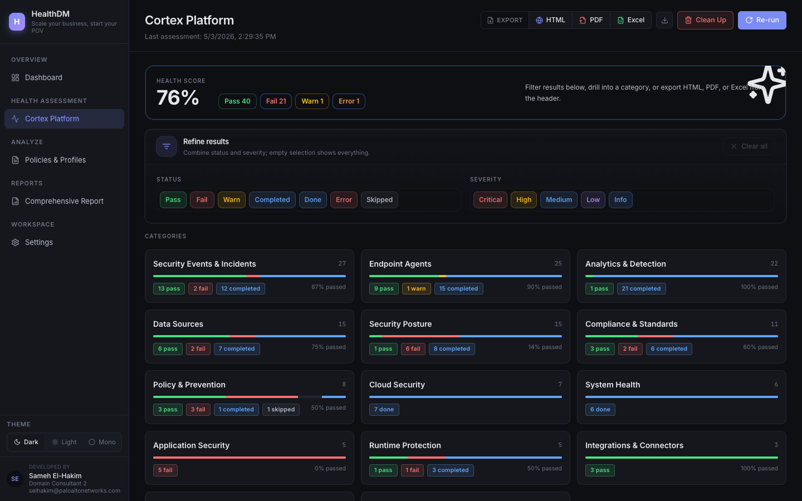

*Figure 1 — Main layout: sidebar on the left, content area on the right. The active section is highlighted in the sidebar.*

---

## 3. Cortex Platform assessment

The **Cortex Platform** page is the core of HealthDM. It runs 151 health checks across 14 categories and shows an overall health score at the top.

### 3.1 Running and refreshing an assessment

The toolbar in the top-right of the page has two action buttons:

- **Re-run** — queues a full new assessment run against your configured Cortex connection. The page updates when the run finishes.
- **Clean Up** — clears stale cached run data.

> 💡 Wait for the assessment to finish before exporting — the score and check counts update live as results come in.

### 3.2 Reading the health score

Below the toolbar you see the **overall health score** (e.g. 76%) alongside a breakdown: `Pass` `Fail` `Warn` `Error` `Completed`. These counters reflect the current run across all 151 checks.

### 3.3 Filtering results

The **Refine results** panel lets you narrow which category tiles are shown. There are two independent rows of toggle buttons:

- **Status** — Pass, Fail, Warn, Completed, Done, Error, Skipped
- **Severity** — Critical, High, Medium, Low, Info

Click one or more buttons to activate them; the category tiles below update instantly to show only categories that contain matching checks. Click **Clear all** to reset. Leaving all buttons unselected shows everything.

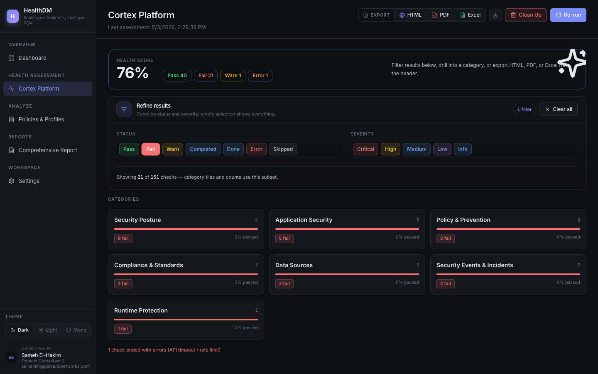

*Figure 2 — Filtering by **Fail** status: only categories that contain failed checks are shown. Combine status and severity filters to narrow further.*

### 3.4 Exporting results

Three export formats are available from the toolbar: **HTML** **PDF** **Excel**. All three open the same selection modal — only the output format differs.

**Steps:**

1. Click the format button (e.g. **HTML**) in the top toolbar. The export modal opens.
2. Use the **quick-filter pills** at the top of the modal to seed your selection:
   - `All` — selects every check (default)
   - `With Findings` — selects checks that have any result data
   - `Failed + Warning` — selects only failed and warned checks
   - `Critical + High` — selects only critical and high severity checks
3. Checks are grouped by category (e.g. *Endpoints 25/25*). Click the **▾ arrow** to expand a group and see individual checks with their severity, status, and count. Use the **Clear group** button to deselect an entire category at once.
4. Tick or untick individual checkboxes to fine-tune the selection. The **Export N** button at the bottom shows how many checks are included.
5. Click **Export N** to download the file. Click **Cancel** to close without exporting.

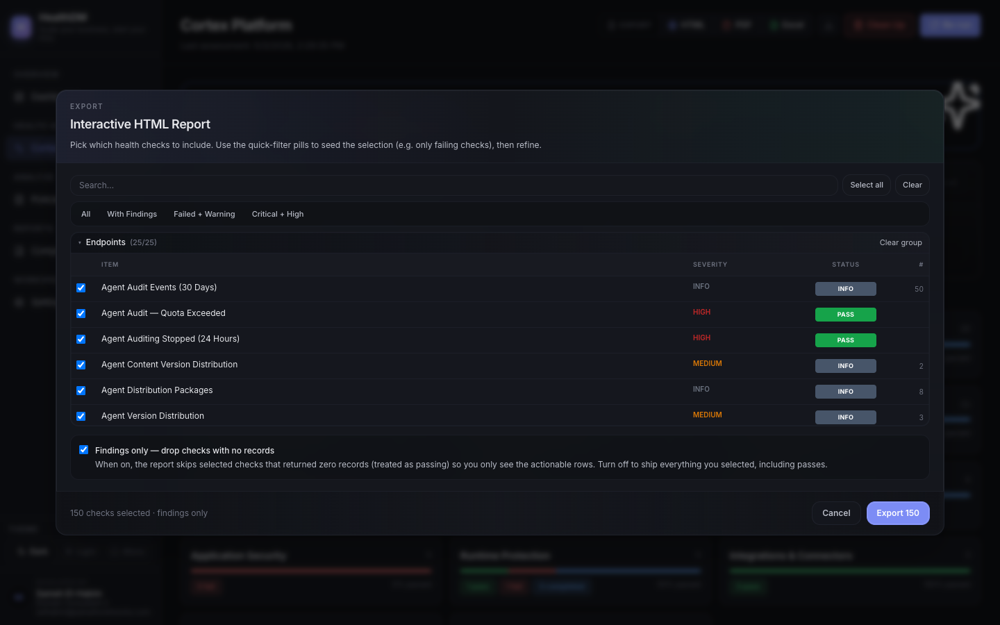

*Figure 3 — Cortex export modal: use the filter pills to seed the selection, expand groups to adjust individual checks, then click **Export N** to download.*

---

## 4. Drilling into a category

Click any **category tile** on the Cortex Platform page to open the category detail view. This shows every individual check in that category, with its own status and severity.

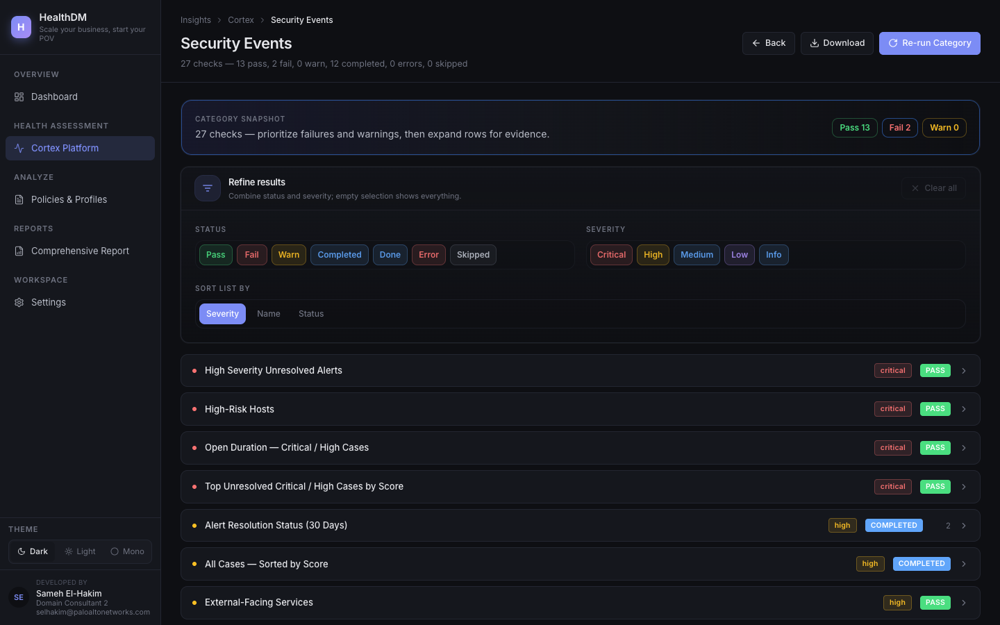

*Figure 4 — Category detail view: breadcrumb navigation at the top, check list below. Each row shows the check name, severity badge, and current status.*

### What's on the category page

- **Breadcrumb** — *Insights → Cortex → Category Name*. Click *Cortex* to go back to the overview.
- **Category snapshot** — Pass / Fail / Warn counters for this category only.
- **Refine results** — same Status + Severity filter toggles as the overview, scoped to this category.
- **Download** — exports this category's checks only (same modal flow as the overview export).
- **Re-run Category** — re-runs only the checks in this category without triggering a full assessment.

> 💡 Use **Re-run Category** after fixing an issue to confirm it resolved without waiting for a full 151-check run.

---

## 5. Dashboard

The **Dashboard** gives you an executive-level view that combines Cortex health assessment results with Policies & Profiles compliance in one place. Use it for a quick status check before diving into details.

### 5.1 Overview tab

The default tab shows:

- **Health score** — current score (e.g. 76), letter grade, and stability label.
- **Check distribution** — Passed / Failed / Warnings / Completed totals.
- **Top recommendations** — the highest-priority failures from the latest run, sorted by criticality.
- **Health Score %** and **Policy Score %** — separate tiles for each dimension.
- **Open Failures** — combined count of health + policy failures.
- **Critical Severity** — count of critical-level findings across both health and policy.

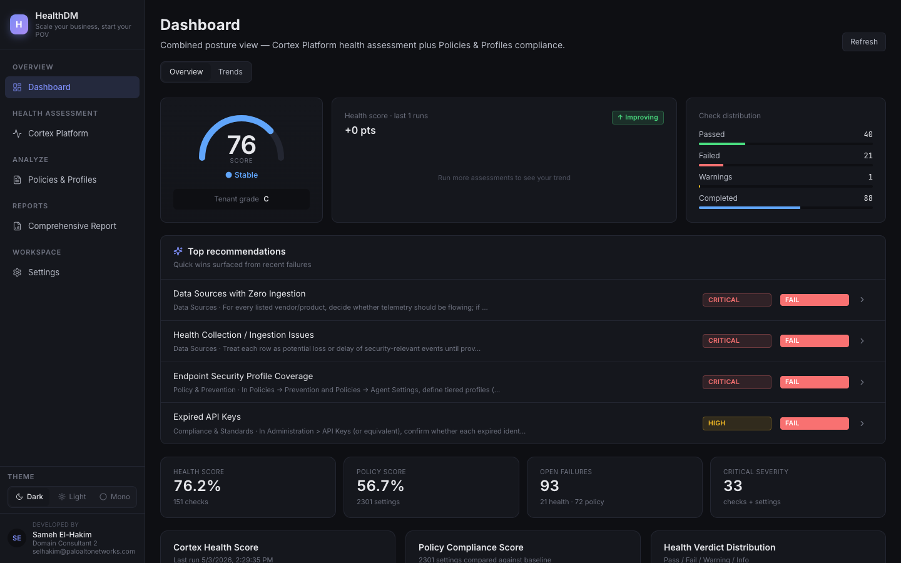

*Figure 5 — Dashboard Overview tab: score summary, check distribution, and top recommendations at a glance.*

### 5.2 Trends tab

Click the **Trends** tab to switch to the historical view. This shows:

- **Latest Score** — score and timestamp of the most recent completed run.
- **Score Change** — point change compared to the previous run.
- **Open Findings** — current open findings count, with change since prior run.
- **Regressions** — checks that previously passed but now fail.
- **Score History chart** — line chart of the overall health score over time (x-axis = date, y-axis = 0–100%).
- **Category Trends** — per-category trend breakdown.

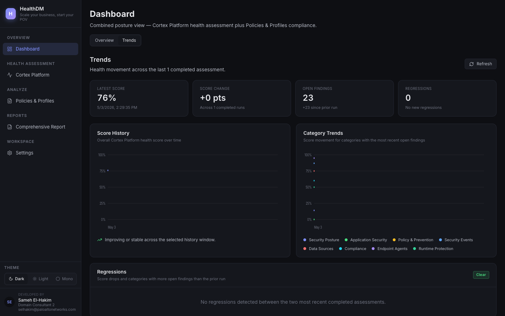

*Figure 6 — Dashboard Trends tab: score history over time and per-category trend breakdown.*

Click **Refresh** (top-right of the Dashboard page) to reload the latest data at any time.

---

## 6. Policies & Profiles

The **Policies & Profiles** page lets you import Cortex `.export` bundles (prevention policies and extension policy rules), compare them against your configured baselines, and generate policy-scoped reports.

### 6.1 Importing a policy bundle

1. Navigate to **Analyze → Policies & Profiles** in the sidebar.
2. Drag and drop a Cortex `.export` file onto the import zone, or click inside it to open a file picker.
3. The app parses the bundle, stores it, and compares it against the configured baselines automatically.
4. The imported bundle appears in the list with its comparison score and per-rule status.

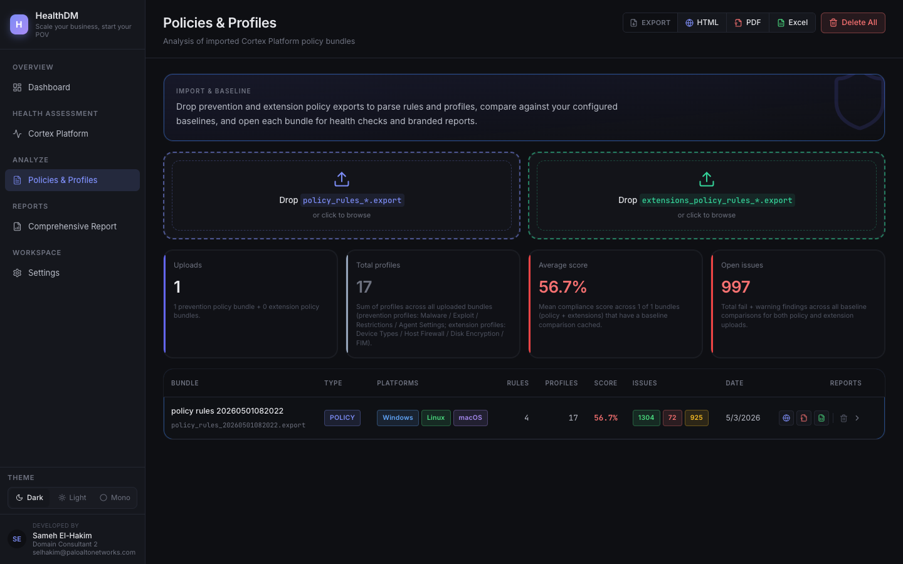

*Figure 7 — Policies & Profiles page: drag-and-drop import zone at the top, imported bundles listed below with scores and actions.*

### 6.2 Exporting a policy report

Three export formats are available from the toolbar: **HTML** **PDF** **Excel**. The export modal lets you choose which **profiles** (not individual checks) to include.

**Steps:**

1. Click the format button (e.g. **HTML**) in the toolbar. The export modal opens.
2. Use the filter pills to seed your selection: `Select all` / `Clear` / `All` / `With Findings` / `Failed + Warning` / `Critical + High`.
3. Profiles are grouped by type — *EXPLOIT*, *MALWARE*, *RESTRICTIONS*, *POLICY_RULE*, *AGENT_SETTINGS*, *EXCEPTIONS*. Click **▾** to expand a group and see individual profiles with their severity and status.
4. Tick or untick profiles as needed. The **Export N** button reflects the current selection count.
5. Click **Export N** to download.

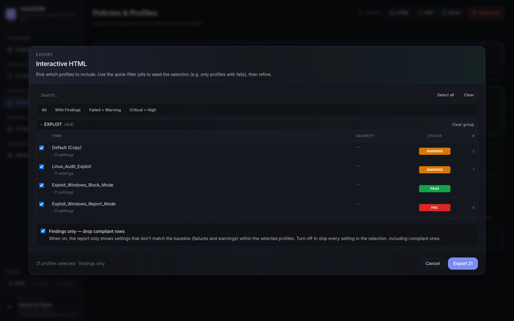

*Figure 8 — Policies export modal: profiles grouped by type, filter pills at the top, Export button at the bottom showing the selected count.*

> ⚠️ **Delete All** (toolbar, far right) removes every imported bundle permanently. There is no undo.

---

## 7. Comprehensive report

The **Comprehensive Report** page combines Cortex health-check results *and* policy/profile data into a single export. It is the most complete output HealthDM produces and is the recommended format for customer deliverables.

Four export formats are offered side-by-side:

| Button | Output | Best used for |
|---|---|---|
| **HTML** | Interactive HTML file | Sharing via browser; clickable, searchable |
| **DOCX** | Word document | Editable deliverables, customer-facing reports |
| **XLSX** | Excel spreadsheet | Data analysis, pivot tables |
| **PDF** | PDF document | Printable, read-only deliverables |

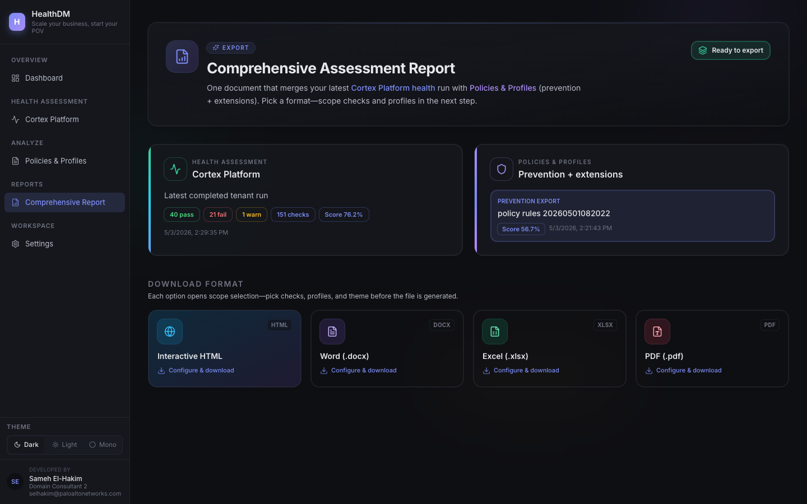

*Figure 9 — Comprehensive Report page: choose your export format. All four formats use the same configuration modal.*

### 7.1 How to export a comprehensive report

All four format buttons open the same export modal with two independent sections — **Health Checks** and **Policy Profiles**. You configure each side separately.

**Steps:**

1. Click a format button — e.g. **HTML**. The export modal opens.

2. **Health Checks section (top half of modal):**
   Use the filter pills to seed the selection:
   - `Select all` — includes all 151 checks
   - `Clear` — deselects everything
   - `With Findings` — only checks that returned data
   - `Failed + Warning` — only failed or warned checks
   - `Critical + High` — only critical and high severity checks

   Checks are grouped by category (e.g. *Endpoints 25/25*, *Security Events 27/27*). Click **▾** to expand and adjust individual checks. Use **Clear group** to deselect a whole category.

3. **Policy Profiles section (bottom half of modal):**
   Scroll down in the modal to reach the policy profiles. The same filter pills apply here.
   Profiles are grouped as: *EXPLOIT*, *MALWARE*, *RESTRICTIONS*, *POLICY_RULE*, *AGENT_SETTINGS*, *EXCEPTIONS*. Expand each group to include or exclude specific profiles.

4. The **Export N** button at the bottom of the modal shows the combined selection count — click it to generate and download the file.

5. Click **Cancel** at any time to close without exporting.

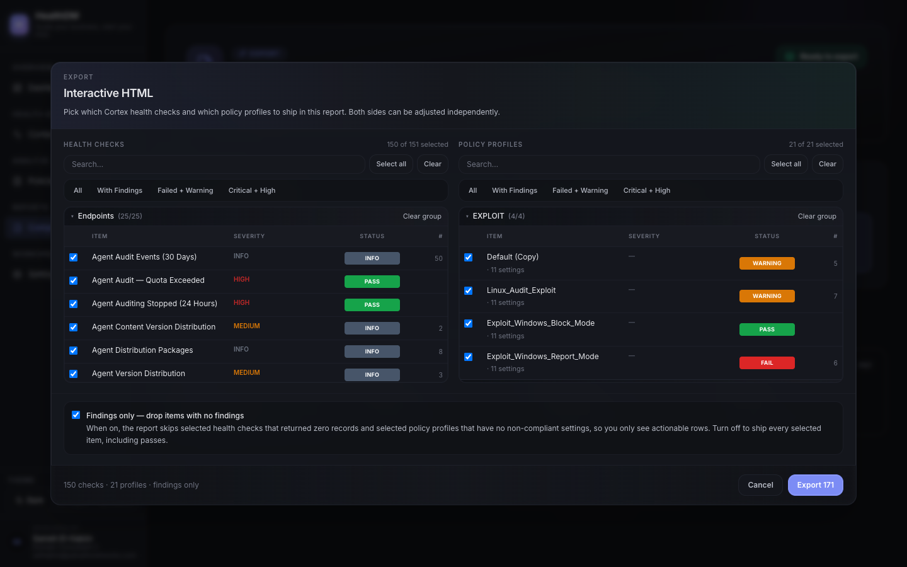

*Figure 10 — Export modal (top): Health Checks section. Use the filter pills to seed the selection, then expand groups to adjust individual checks.*

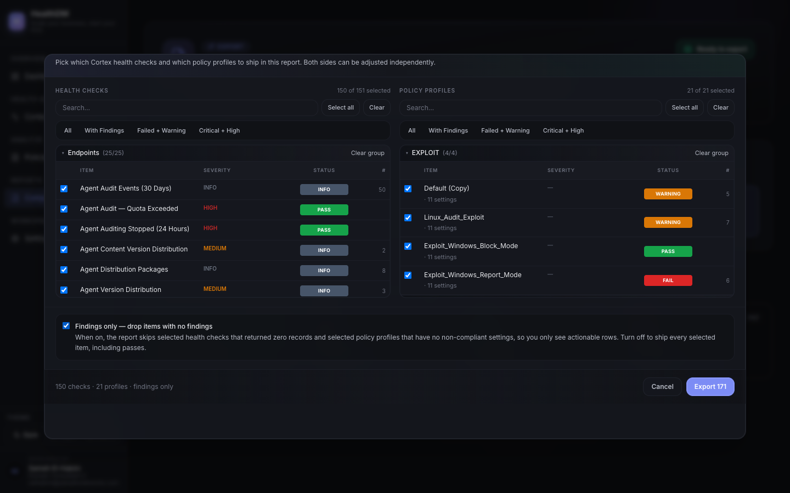

*Figure 11 — Export modal (scrolled down): Policy Profiles section. Select which profiles to include alongside the health checks. The Export button at the bottom reflects the total selection.*

> 💡 For a focused executive report, use `Failed + Warning` on the Health Checks side and `With Findings` on the Policy Profiles side — this keeps the document concise and action-oriented.

---

## 8. Settings — Cortex Platform Credentials

Open **Workspace → Settings** in the sidebar. The settings area has five tabs in a left panel. **Cortex Platform Credentials** is the first tab and must be filled in before anything else works.

### Fields

- **API URL** — your Cortex XSIAM tenant base URL, e.g. `https://api-yourtenant.xdr.us.paloaltonetworks.com`
- **API Key** — your Cortex API key. Leave blank to keep an existing saved key.
- **Auth ID** — the Auth ID associated with your API key. Leave blank to keep an existing saved value.

**Steps:**

1. Enter your API URL, API Key, and Auth ID.
2. Click **Save**. The status indicator at the top of the tab shows **● Connected** (green) once credentials are accepted.

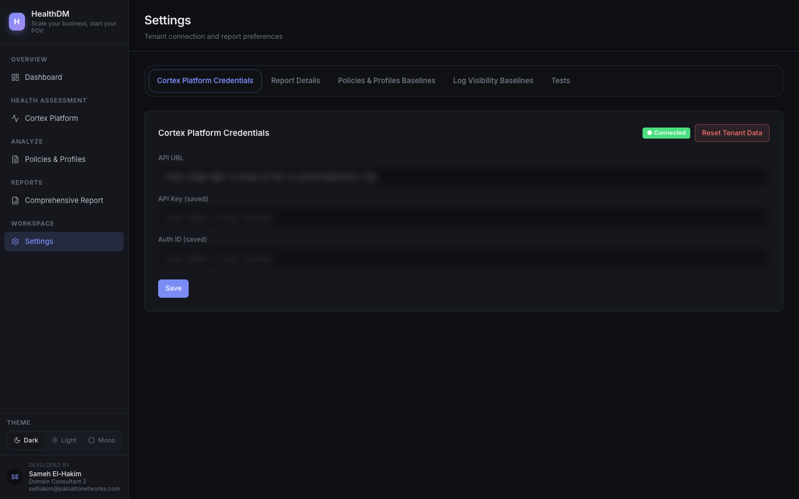

*Figure 12 — Credentials tab: enter your API URL, Key, and Auth ID, then Save. Sensitive fields are intentionally obscured in this guide.*

> ⚠️ **Reset Tenant Data** (red button at the bottom of the tab) wipes all stored assessment data for the current tenant. This cannot be undone — only use it when starting fresh with a new tenant.

---

## 9. Settings — Report Details

Click the **Report Details** tab in the Settings left panel. These fields populate the dynamic placeholders embedded in every generated report — customer name, consultant details, and tenant identifiers. Fill them in once and they are reused across all export formats.

| Field | Placeholder in reports | Example |
|---|---|---|
| Customer Name | `{CUSTOMER_NAME}` | Acme Corp |
| Cortex Project ID | `{CORTEX_PROJECT_ID}` | PRJ-00123 |
| Cortex ID | `{CORTEX_ID}` | tenant-id-here |
| Cortex URL | `{CORTEX_URL}` | https://your-tenant.xdr.eu… |
| Consultant Name | `{CONSULTANT_NAME}` | Jane Smith |
| Consultant Title | `{CONSULTANT_TITLE}` | Domain Consultant |
| Consultant Email | `{CONSULTANT_EMAIL}` | jane@example.com |

Fill in the fields and click **Save**. The report date is populated automatically at generation time.

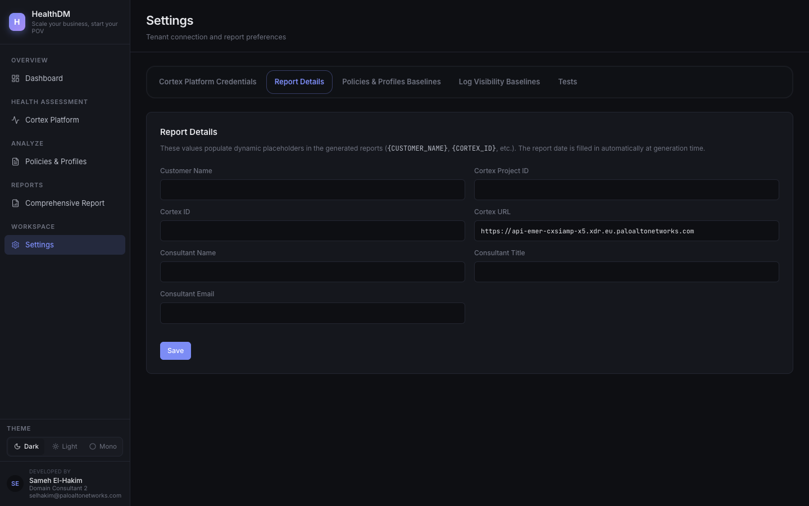

*Figure 13 — Report Details tab: fill in these fields once and every generated report will include your customer and consultant information.*

---

## 10. Settings — Policies & Profiles Baselines

Click the **Policies & Profiles Baselines** tab. Baselines are the reference `.export` files that imported policy bundles are compared against. Upload one per operating system to override the built-in defaults.

### Prevention Baselines

One baseline file per platform: **Windows**, **macOS**, **Linux**, **Android**, **iOS/iPadOS**. Each card explains exactly how to obtain the file from Cortex XSIAM (*Endpoints → Policy Management → Profiles → Export*).

### Extension Policy Baselines

Separate baseline files for Extension Policy Rules, currently supporting **Windows**. The card shows whether you are using the combined built-in baseline or a custom upload.

**Steps:**

1. Click the platform card you want to update (e.g. *Windows*).
2. Click inside the upload area or drag a `.export` file onto it.
3. The baseline is saved immediately — no separate Save button is needed.

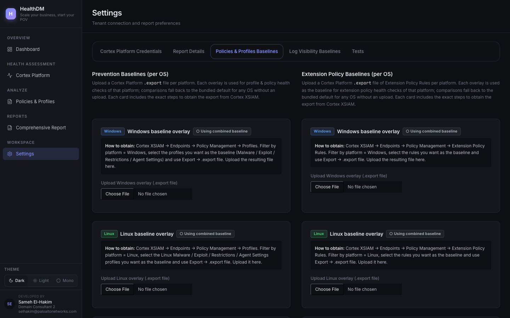

*Figure 14 — Baselines tab: one upload card per operating system. Each card includes the steps to export the file from Cortex XSIAM.*

---

## 11. Settings — Tests

Click the **Tests** tab. This is where you control which health checks run in future assessments and what severity level each check uses.

The tab shows a summary badge at the top — e.g. **117 enabled** / **34 disabled** — so you can see your current configuration at a glance.

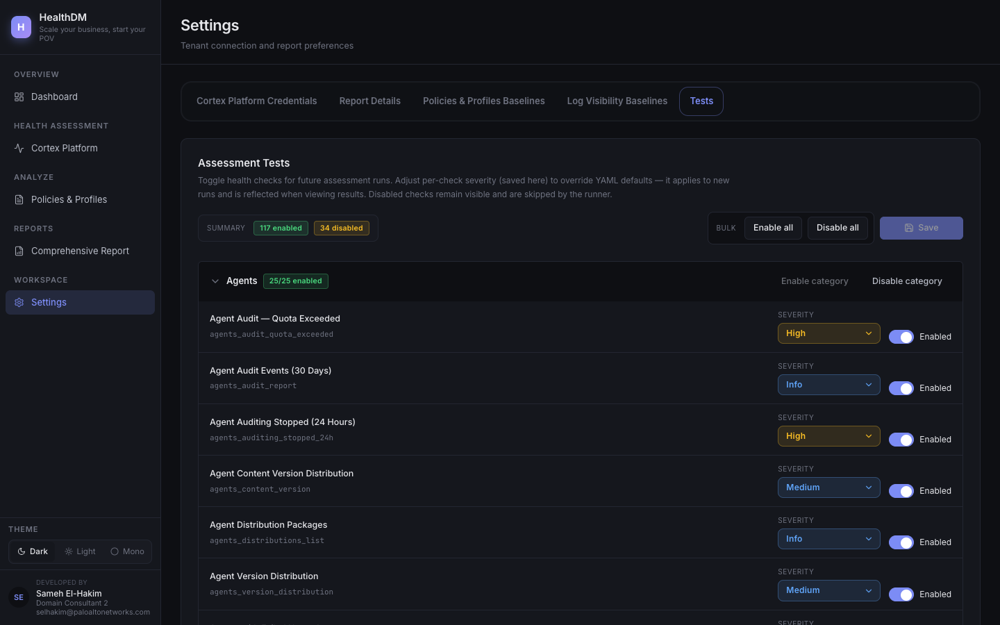

*Figure 15 — Tests tab: all 151 health checks listed by category, each with an enable toggle and a severity dropdown.*

### 11.1 Enabling and disabling tests

You can enable or disable tests at three levels:

| Level | How | Effect |
|---|---|---|
| **All tests** | Click **Enable all** or **Disable all** at the top of the page | Turns every check on or off in one click |
| **Category** | Click **Enable category** or **Disable category** next to the category heading | Turns all checks in that group on or off |
| **Individual check** | Toggle the checkbox on the right side of any test row | Turns that single check on or off |

> Disabled checks are **not deleted** — they remain visible in results as *Skipped* and are simply not executed during the next run.

### 11.2 Changing a test's severity

Every check has a **severity dropdown** in its row. The default comes from the YAML configuration, but you can override it here per-check. Changing severity affects how the check is weighted in scores, how it appears in export filters (e.g. the `Critical + High` pill), and how it shows in results.

**Steps:**

1. Find the check whose severity you want to change. Scroll through the list or use your browser's `Ctrl`+`F` to search by name.
2. Click the **severity dropdown** in that row — options are `Critical`, `High`, `Medium`, `Low`, `Info`.
3. Select the new severity level.

*Figure 16 — Individual test rows: each row shows the test name, its YAML slug, a severity dropdown, and an enable/disable toggle.*

### 11.3 Saving your changes

After making any combination of enable/disable changes or severity overrides, click **Save** at the top of the Tests tab. Changes take effect on the **next** assessment run — they do not retroactively alter existing results.

> 💡 The test slug shown under each name (e.g. `agents_audit_quota_exceeded`) is the YAML identifier — useful for referencing checks in custom scripts or when contacting support.

---

## 12. Theme switcher

The three theme buttons at the bottom of the sidebar — `Dark` `Light` `Mono` — change the app's colour scheme instantly. The selection persists across page navigation and browser reloads. No restart is required.

---

*HealthDM user guide · Screenshots captured from a live instance at http://localhost:8800 · Application routes and labels reflect the Next.js frontend under `frontend/app`; update this file if navigation changes.*
